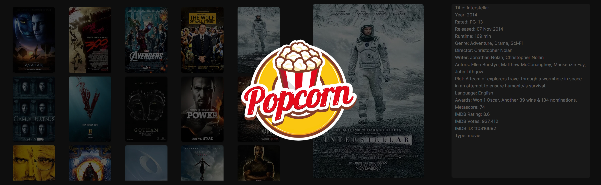

<h1 align="center">Smart TV</h1>

  A Smart TV app simulation on the browser.

  <a href="#-technologies">Technologies</a>&nbsp;&nbsp;&nbsp;|&nbsp;&nbsp;&nbsp;
  <a href="#-how-to-run">How to Run</a>&nbsp;&nbsp;&nbsp;|&nbsp;&nbsp;&nbsp;
    <a href="#-packages">Packages</a>&nbsp;&nbsp;&nbsp;|&nbsp;&nbsp;&nbsp;
  <a href="#-learn-more">Learn More</a>&nbsp;&nbsp;&nbsp;

  

  

 

## 🚀 Technologies

This project was developed by these next technologies:

- Next.js / React
- Typescript
- Tailwind

## 📦 Packages

- next-intl (branch translations)
- clsx (branch translations)

## 💻 How to Run

- Clone the repository
- Install dependencies with `npm i`
- Start the server with `npm run dev`
- Open [http://localhost:3000](http://localhost:3000) with your browser to see the result.

## 💡 Learn More

To learn more about Next.js, take a look at the following resources:

- [Next.js Documentation](https://nextjs.org/docs) - learn about Next.js features and API.
- [Learn Next.js](https://nextjs.org/learn) - an interactive Next.js tutorial.

You can check out [the Next.js GitHub repository](https://github.com/vercel/next.js/) - your feedback and contributions are welcome!

---

This is a [Next.js](https://nextjs.org/) project bootstrapped with [`create-next-app`](https://github.com/vercel/next.js/tree/canary/packages/create-next-app).
